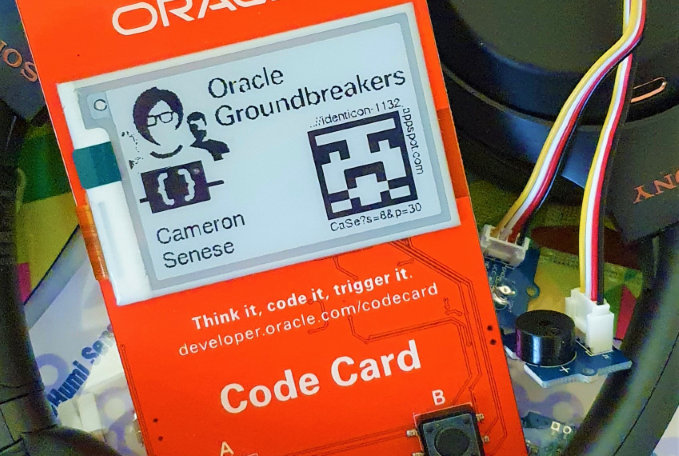
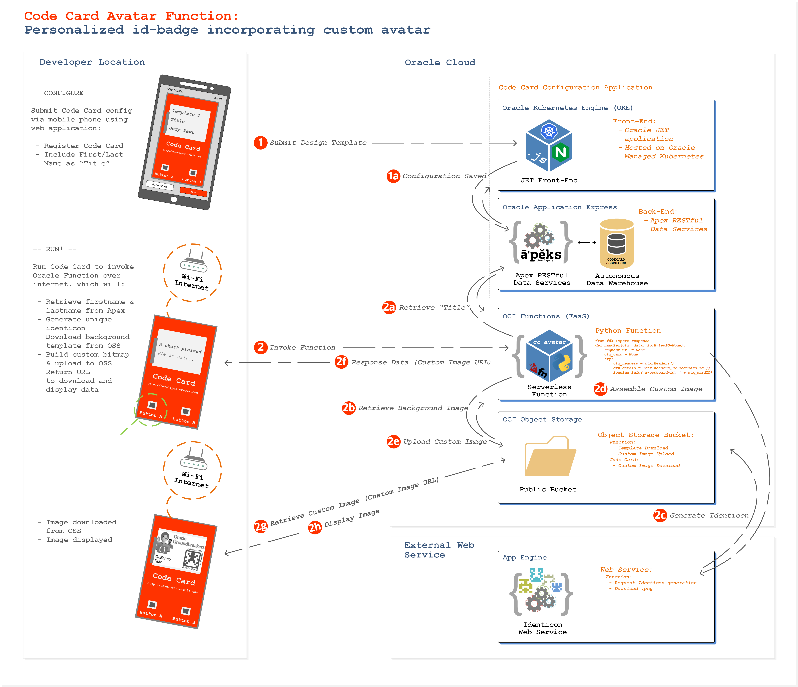
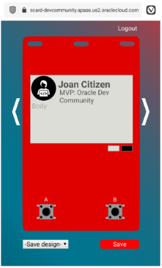

[oci]:https://cloud.oracle.com/en_US/cloud-infrastructure
[oci-signup]:https://cloud.oracle.com/tryit

# Code Card Avatar Function

## Introduction

The Oracle Code Card is a Wi-Fi-enabled IoT device with an e-paper display that's able to interact with remote API endpoints, and retrieve and display content from cloud platforms such as Oracle Cloud Infrastructure. The Code Card runs on an [ESP8266](https://en.wikipedia.org/wiki/ESP8266) Wi-Fi microcontroller. 

The Code Card avatar serverless function transforms your Code Card into an awesome, personalized id-badge!  



The function is designed to assemble and display a bitmap image which includes a unique card-owner identicon that's generated on-the-fly via a 3rd party API, and is based on a hash of the card owner's name.

Apart from turning your Code Card into a personalized id-badge, the avatar function is a great reference for building an Oracle function which when invoked coordinates a number of interactions with a range of OCI services, external services, and the Code Card IoT device itself.

## Overview

The avatar function is implemented as an Oracle Function (i.e. an OCI managed serverless function):

 - the function is invoked via an API published via the OCI API Gateway Service
 - the Oracle Function itself is written in Python: [codecard-avatar/func.py]( /codecard-avatar/func.py)
 - the function uses a custom container image based on oraclelinux:7-slim, and also includes rh-python36 and ImageMagick: [codecard-avatar/Dockerfile]( /codecard-avatar/Dockerfile)



In reference to the workflow illustration, there are two main elements to the workflow:

1. During the "Configure" phase, the Code Card is configured using the Code Card Configurator mobile application (here the Code Card unique ID and owner's name are registered in a database table hosted on Oracle APEX)
2. During the "Run" phase, the avatar function is then invoked by the Code Card via API Gateway, which initiates a a series of interactions with:

   - the Code Card designer APEX backend
   - the identicon generation web service
   - OCI object storage

Next, with the gathered artefacts the function proceeds to assemble the id-badge custom bitmap, and directs the Code Card to download and display the image via the object storage service.

## Implementation

This implementation instruction describes the process for implementing each of the following solution components, including object storage, avatar generation serverless function, and API gateway.

*This work instruction assumes that you will be utilising the shared [Code Card Designer](http://bit.ly/2PdOiU1) mobile application, and the associated back-end platform hosted at: `https://apex.oracle.com/pls/apex/appslab/functions/master`. If you would like to build and host your own Code Card back-end, check out the work instruction over [here](https://learncodeshare.net/2020/01/29/use-ords-to-run-the-codecard-backend-on-your-own-free-oracle-cloud-database/).*

Resources referenced in this tutorial will be named as follows:

 - Compartment containing the function: ***fn-compartment***
 - OCI IAM Function Dynamic Group Name: ***fnfunc-avatar***
 - Oracle Functions Application Name: ***codecard***
 - OCI IAM API GW Dynamic Group Name: ***gwfunc-avatar***
 - API Gateway name: ***gw-codecard***
 - API Gateway Deployment name: ***gw-avatar-deployment***
 - Object Storage Bucket Name: ***codecard-avatar***
 - Function Name: ***codecard-avatar***

### Prerequisites

The following should be completed before going ahead and creating the autoscaler function:
 - **OCI Tenancy:** If you don't already have an OCI tenancy, you can sign-up right [here](https://www.oracle.com/cloud/free/) and experience the benefits of OCI with the included always free services
 - **Set up your tenancy for function development:** Follow the link to [this tutorial](https://docs.cloud.oracle.com/iaas/Content/Functions/Tasks/functionsconfiguringtenancies.htm) for guidance on the process
 - **Configure your client environment for function development:** Before you can start using Oracle Functions to create and deploy functions, you need to set up your client environment for function development: follow the link to [this tutorial](https://docs.cloud.oracle.com/iaas/Content/Functions/Tasks/functionsconfiguringclient.htm) for guidance on the process

#### Additional IAM Policies

When a function you've deployed to Oracle Functions is running, it can access other Oracle Cloud Infrastructure resources. To enable a function to access another Oracle Cloud Infrastructure resource, you need to include the function in a dynamic group, and then create a policy to grant the dynamic group access to that resource. Follow the link to [this tutorial](https://docs.cloud.oracle.com/iaas/Content/Functions/Tasks/functionsaccessingociresources.htm) for guidance on creating a dynamic group. 

Follow the process to create the dynamic groups required for both the Functions and API Gateway Services. 

For our deployment scenario we'll require our dynamic groups to access a range of services, including the network and object storage. To enable this, create the following dynamic group and additional IAM policies:

#### Dynamic Group

For the below dynamic group definition, the `resource.compartment.id` is that of the "fn-compartment" where the application and associated function will be deployed:

```
ALL {resource.type = 'fnfunc', resource.compartment.id = 'ocid1.compartment.oc1..aaaaaaaafnaar7sww76or6eyb3j625uji3tp4cb4tosaxx4wbxvvagzzzzzz'}
```

#### IAM Policies

Create the additional IAM policies:

```
Allow dynamic-group fnfunc-avatar to use subnets in compartment fn-compartment
Allow dynamic-group fnfunc-avatar to read virtual-network-family in compartment fn-compartment
Allow dynamic-group fnfunc-avatar to use vnics in compartment fn-compartment
Allow dynamic-group fnfunc-avatar to inspect compartments in compartment fn-compartment
Allow dynamic-group fnfunc-avatar to manage objects in compartment fn-compartment
Allow dynamic-group gwfunc-avatar to use functions-family in compartment fn-compartment
```

#### Clone the `codecard-avatar` Git Repository

Now let's clone the `codecard-avatar` repository:

```
$ git clone https://nnn/codecard-avatar.git
```

Commands from this point forward will assume that you are in the `../codecard-avatar` directory, which is the directory containing the function code, and other dependencies such as the Dockerfile used to build the container image, the func.yaml (function configuration file), and a Python requirements definition file.

### Object Storage Bucket

The avatar function requires an object storage bucket to both host the background template image, and to host the finalised custom image that's downloaded and diplayed by the Code Card.

To create and configure the object storage bucket using the OCI console, visit the product documentation [here](https://docs.cloud.oracle.com/en-us/iaas/Content/Object/Tasks/managingbuckets.htm), and then:

1. Create the bucket named `codecard-avatar` by following the section "To create a bucket"
2. Set the bucket as public, by following the section "To change the visibility of a bucket"

Copy the background template bitmap `../codecard-avatar/images/background/identicon_bg.bmp` to the `codecard-avatar` bucket.

For guidance on the process using the OCI console, visit the product documentation [here](https://docs.cloud.oracle.com/en-us/iaas/Content/Object/Tasks/managingobjects.htm), and follow the section "To upload objects to a bucket or folder".

Finally, make a record of the URI of the object storage bucket, using the format:
`https://objectstorage.<region>.oraclecloud.com/n/<object-storage-namespace>/b/<bucket-name>`. 

This value will be provided as the configuration parameter `oss_bucket` within the avatar function, as described in a later section of this work instruction.

### Serverless Application and Function

In Oracle Functions, an application is a logical grouping of functions & a common context to store configuration variables that are available to all functions in the application. 

#### Create Oracle Functions Application: `codecard`

Now create an application named `codecard` to host the `codecard-avatar` function. Follow the link to [this tutorial](https://docs.cloud.oracle.com/iaas/Content/Functions/Tasks/functionscreatingapps.htm) for guidance on the process.

*When creating applications, Oracle recommends that you use the same region as the container registry that's specified in the Fn Project CLI context, and be sure to select the compartment specified in the Fn Project CLI context.*

#### Create Function: `codecard-avatar`

Next, to create the function.  

#### Create the Function

*Remember that all commands assume that you are in the `../codecard-avatar` directory of the `codecard-avatar` repository which is the directory containing the function code, and other dependencies such as the Dockerfile used to build the container image, the func.yaml (function configuration file), and a Python requirements definition file.*

Enter the following single Fn Project command to build the function and its dependencies as a Docker image, push the image to the specified Docker registry, and deploy the function to Oracle Functions:

```
$ fn -v deploy --app codecard
```

The Fn Project CLI will generate output similar to the following (abbreviated) detailing the steps taken to build and deploy the function.

```
$ Deploying codecard-avatar to app: codecard
$ Bumped to version 0.0.1
$ Building image...
$ ...
$ ...
$ 0.0.1: digest: sha256:71c0f9fac6164b676b781970b5d79b86a28838081c6ea88e00cc1cf07630ccc6 size: 1363
$ Updating function codecard-avatar using image iad.ocir.io/tenancy/codecard/codecard-avatar:0.0.1...
```

#### Implement Function Configuration Parameters

Now that we have our function built and deployed - it requires the creation of a number of configuration parameters in order for it to operate successfully. User defined configuration parameters are made available to the function at runtime via key-value pairs known as custom configuration parameters.

The avatar function requires that each of the custom configuration parameters be set. Invoking the function without passing all custom configuration parameters will cause the function to fail.

To specify custom configuration parameters using the Fn Project CLI, the following command format is used:

```
$ fn config function <app-name> <function-name> <key> <value>
```

Create the following custom configuration parameters using the config function command:

*-- APEX URL*
```
$ fn config function codecard codecard-avatar apex_url <value>
```
 - Type: String
 - The `<value>` field should contain the URL of the Code Card back-end APEX application.
 - If you are using the publicly available shared instance, the value should be: `https://apex.oracle.com/pls/apex/appslab/functions/master`.

*-- Identicon Service*
```
$ fn config function codecard codecard-avatar identicon_service <value>
```
 - Type: String
 - The `<value>` field should contain the URL of an identicon generation web service.
 - The function is designed to use the sevice available at:  `http://identicon-1132.appspot.com`.

*-- OSS Bucket*
```
$ fn config function codecard codecard-avatar oss_bucket <value>
```
 - Type: String
 - The `<value>` configures the URL of the object storage bucket used to host background template and custom .bmp data. Insert value generated in the [Object Storage Bucket](#object-storage-bucket)  section of this work instruction.

*-- Image BG Name*
```
$ fn config function codecard codecard-avatar image_bg_name <value>
```
 - Type: String
 - The `<value>` field should contain the file name of the background template .bmp file.
 - The default value is: `identicon_bg` (per the name of the image template uploaded to object storage bucket earlier in the tutorial).

### Configure Function Logging

When a function you've deployed to Oracle Functions is invoked, you'll typically want to store the function's logs so that you can review them later. You specify where Oracle Functions stores a function's logs by setting a logging policy for the application containing the function. Follow the link to [this tutorial](https://docs.cloud.oracle.com/iaas/Content/Functions/Tasks/functionsexportingfunctionlogfiles.htm) for guidance on the process.

### API Gateway

The solution utilizes an API gateway to front-end function invocation requests on the public internet.

#### Create API Gateway

Follow [this](https://docs.cloud.oracle.com/en-us/iaas/Content/APIGateway/Tasks/apigatewaycreatinggateway.htm) work instruction to create the API Gateway in your tenancy.

Input values should be provided as follows:

 - API Gateway name: ***gw-codecard***
 - Type: ***Public***
 - Compartment:  ***fn-compartment***
 - VCN: ***Use the VCN deployed to host the function***
 - Subnet: ***Use the Subnet deployed to host the function***

#### Create API Deployment Specification

Before you can deploy an API on an API gateway, you have to create an API deployment specification. Every API deployment has an API deployment specification.

Each API deployment specification defines a set of resources, and the methods (for example, GET, PUT) that can be performed on each resource.

Follow [this](https://docs.cloud.oracle.com/en-us/iaas/Content/APIGateway/Tasks/apigatewaycreatingdeployment.htm#consolescratch) work instruction to create the API Deployment specification using the OCI console.

*Skip steps 6, 7, & 8 if desired as they are optional.*

Input values should be provided as follows:

##### Basic Information
 - Deployment name: ***codecard***
 - Path Prefix: ***/codecard***
 - Compartment:  ***fn-compartment***

##### Route1
 - Path: ***/avatar***
 - Method: ***POST***
 - Type: ***Oracle Functions***
 - Application: ***codecard***
 - Function Name: ***codecard-avatar***

To obtain the URL to invoke the `codecard-avatar` function:

1. browse to: *Developer Services| API Gateway | Gateways | gw-codecard| Deployment Details* in the OCI console.
2. In the "Deployment Information" section, record the "Endpoint" URL, and include  an appended "/avatar" at the end of the string.

This should look something like the following:

https://db4zhpxkc3pctfju6ziv541234.apigateway.us-ashburn-1.oci.customer-oci.com/codecard/avatar

### Test the Avatar Function

As a quick test, you can now manually invoke the function using curl before we go ahead and configure the Code Card for function invocation.

Before we send our test request to the API endpoint, we need to obtain the unique ID of your Code Card (when the Code Card communicates using HTTP methods, it always includes as a header it's unique ID (it's MAC address). 

To do this, put your Code Card in to configuration mode by performing a simultaneous "double short-press" (press the A & B buttons simultaneously for a sub-second duration).

Once in configuration mode the Code Card will display it's unique ID as both a barcode and alphanumeric string on the e-paper display. Record the unique ID string for use with curl.

To invoke the function using a command shell, submit the following command:

```
curl --header "x-codecard-id: <codecard-id>" -X POST <endpoint-url>
```

Substitute the values `<codecard-id>` and `<endpoint-url>` with Code Card unique ID and API endpoint values as appropriate.

When complete, the avatar function will return a JSON payload similar to the following, which includes the `backgroundImage` URL to the custom bitmap uploaded by the function to the object storage bucket:

``` json
{
   "template":"template8",
   "title":"Joan Citizen",
   "subtitle":"MVP: Oracle Dev Community",
   "bodytext":"",
   "backgroundColor":"white",
   "backgroundImage":"https://objectstorage.<region>.oraclecloud.com/n/<tenancy>/b/codecard/o/identicon_bg_JoCi.bmp"
}
```

## Invoke with Code Card

### Preparation
In order to have your Code Card invoke the avatar function and your name and personalised identicon - the following preparatory steps need to be taken.

#### Code Card Designer
Using the [Code Card designer mobile application](http://bit.ly/2PdOiU1), register the Code Card using the Code Card unique ID (MAC Address).

Next save the "Template 1" layout to the "A short press" action, ensuring the "title" field contains your Firstname and Lastname as space separated, e.g. "Joan Citizen":



#### Code Card

The final step is to configure the Code Card to invoke the avatar function!
In this example, we will program the `shortpress` action for button `A` on the card.

#### Establish serial connection with Code Card
In order to configure our Code Card, we need to establish a serial connection over USB to the CodeCard CLI. Follow [this guide](https://github.com/cameronsenese/codecard/blob/master/terminal/README.md#connect-via-terminal-emulator) to establish the serial over USB connection. Remember to ensure that the Code Card WiFi settings are configure correctly also! (Direction available from the referenced guide).

#### Configure `buttona1` button action
*In the Code Card CLI, `buttona1` correlates to button A shortpress action.*

In your terminal session you should now see the CodeCard CLI Menu, as follows.

```
***************************************************************************************
  Code Card v1.0
  Oracle Groundbreakers
  developer.oracle.com/codecard
***************************************************************************************
Commands:
  ls                Show all stored key/values
  help              Show this help
  shortpress[a|b]   Simulate the press of a button
  longpress[a|b]    Simulate the long press of a button
  connect           Connect to wifi
  disconnect        Disconnect wifi
  restart           Restart wifi
  status            Show wifi status
  home              Show home screen
  reset             Reset to factory settings

Usage:
  Read saved key value:
    key
  Save new key value:
    key=[value]

Available keys:
  ssid, password, buttona1, buttona2, buttonb1, buttonb2, fingerprinta1, fingerprinta2,
  fingerprintb1, fingerprintb2, methoda1, methoda2, methodb1, methodb2,
>>>
```

First, we will set the HTTP method for the A shortpress by entering the following command.
*Keep in mind that pausing for 2 seconds while typing will automatically enter the command. It may be easier to pre-type the commands elsewhere and copy-paste them into the window.*

```
methoda1=POST
```

Code Card will confirm setting update as follows.

```
>>>
Value saved for methoda1: POST
>>>
```

Next configure the HTTP endpoint for the A shortpress by entering the following command. Be sure to substitute values in `<brackets>` as appropriate.

```
buttona1=<endpoint-url>
```

Code Card will confirm setting update as follows.

```
>>>
Value saved for buttona1: <endpoint-url>
>>>
```

### Invoke the function from the Code Card
Ok, so now our avatar function and Code Card are ready to Go! Powercycle your Code Card and perform a button A shortpress. If your card is still connected via the serial connection, you will see output similar to the following.

```
>>>
Connecting to 'accesspoint1' .................connected!
IP address: 192.168.43.168
MAC address: CC:50:E3:CC:BF:FF
>>>
Request:
  host: db4zhpxkc3pctfju6ziv541234.apigateway.us-ashburn-1.oci.customer-oci.com
  port: 443
  url: https://db4zhpxkc3pctfju6ziv54323u.apigateway.us-ashburn-1.oci.customer-oci.com/codecard/avatar
  fingerprint: 2E 66 84 9D A5 2F 1C FC 40 85 9E 73 9F B3 AD 4E 9C 1C F8 ED
  method: POST
application/json
Response:
  {"template":"template8","title":"Joan Citizen","subtitle":"MVP: Oracle Dev Community","bodytext":"","backgroundColor":"white","backgroundImage":"https://objectstorage.<region>.oraclecloud.com/n/<tenancy>/b/codecard/o/identicon_bg_JoCi.bmp"}
>>>
Request:
  host: objectstorage.<region>.oraclecloud.com
  port: 443
  url: https://objectstorage.<region>.oraclecloud.com/n/<tenancy>/b/codecard/o/identicon_bg_JoCi.bmp
  fingerprint:
  method: GET
Response:
  HTTP/1.1 200 OK
  File size: 139530
  Image Offset: 138
  Header size: 124
  Bit Depth: 24
  Image size: 176x264
  waited for available 1625 ms
  waited for available 1115 ms
  waited for available 1626 ms
  waited for available 1114 ms
  waited for available 1626 ms
  waited for available 1626 ms
  waited for available 1114 ms
  waited for available 1626 ms
  waited for available 1114 ms
  waited for available 1626 ms
  waited for available 1114 ms
  waited for available 1626 ms
  waited for available 2880 ms
  waited for available 1627 ms
  waited for available 7787 ms
  waited for available 1626 ms
  waited for available 4033 ms
  waited for available 1626 ms
  waited for available 3432 ms
  waited for available 1625 ms
  waited for available 2866 ms
  waited for available 1626 ms
  waited for available 2863 ms
  downloaded in 50281 ms
  bytes read 139530
Shuting down...
```

Once completed, the custom bitmap will be output to the e-paper display:

  

The bitmap file is also available for download from the object storage bucket.